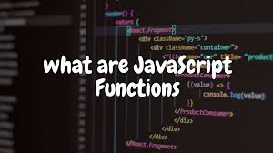

# **JavaScript Functions**

### *The function is the way to store the steps needed to achive a task, it is used to reduce the code.*

### ***Function should be given a name describes the task, calling the function is asking it to perform its task.***

#### *The finction has a **Name** , **UpdateMessage** , and the **Value**. When you call the function's name it will run the statements assigned inside the **Value** .*

    Functionkeyword FunctionName () {
        Statement to be excuted ();
    }

### When the function needs information to rum the statement we put the information iside the ( ) as variables.
****
## Example:

    function printInput (orderf,numOfbedsf){
    document.write ('Your choice is :'+ orderf +' room Consists of '+numOfbedsf+ 'beds');
    }
    printInput (order,numOfbeds)