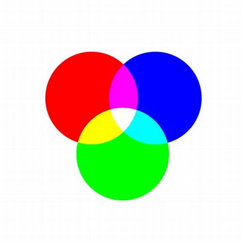

# **HTML images, CSS color and text.**
---
## **Images**
---
**All images are subjected to copyrights and you may get in trouble for taking photos from another website.**
### Images should be:
* Relevant
* Convey information
* Convey the right mood
* recognisable
* Fit the palette
### When you creat a website, you should creat a folder for the images used.

### How to add images?
``
### Image size can be changed by using `hight` and `width` attributes.
### Also the image align by :
* `align-left`
* `align-right`
* `align-top`
* `align-middle`
* `align-bottom`
## **Images format**
### JPEG: used for photographs because they contain alot of colors and large resolution.

### GIF : few colors or large area of the same color (flat color).

--- 
## **Figure and figure caption:**
The attributes `figure` and `figcaption` are used for figures.

---
# ***Colors in CSS***
## *There are standard color codes can be used in CSS and HTML*
## **There are three ways to specify a Forgroundcolor and background color in CSS**
* **RGB** *values*
It is about how much **Green, Red, and Blue** *Values can be expressed in number between 0 and 255*
* **HEX** *codes*
6 digits code that starts with **#** 
*  **Color Names** *Red for example*
* **HLSA**
## **By default all browsers have a white background color**

### *All colors in the computers are made by mixing the main colors shown*
Example:

    footer {
         line-height: 20px;
          background-color:rgb(79, 15, 226); 
          }
*******
## ***Contrast***
* *Low contrast*
* *Medium contrast*
* *High contrast*

### *Extra value for RGB is by the opacity*
---
# **Text**
* Serif : 
Serif fonts have extra details on
the ends of the main strokes of
the letters. These details are
known as serifs.
* Sans-Serif: 
Sans-serif fonts have straight
ends to letters, and therefore
have a much cleaner design.
* Monospace : 
Every letter in a monospace (or
fixed-width) font is the same
width.
* Cursive : 
Cursive fonts either have
joining strokes or other cursive
characteristics, such as
handwriting styles.
* Fantasy : 
Fantasy fonts are usually
decorative fonts and are often
used for titles. They're not
designed for long bodies of text.
### Here are example of text type and size:

---

