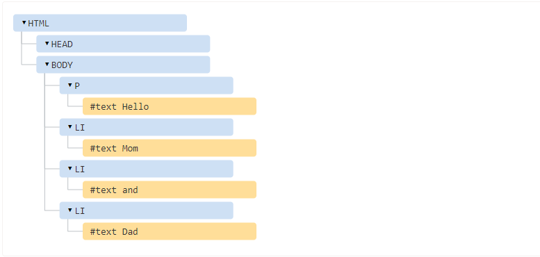
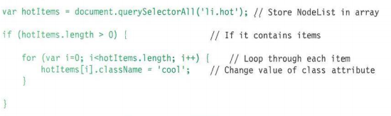

# Understanding the problem domain:
### If understanding the problem domain is the hardest part of programming and you want to make programming easier, you can do one of two things:

* Make the problem domain easier
* Get better at understanding the problem domain.
---
# OBJECT
Objects group together a set of variables and functions to create a model
of a something you would recognize from the real world.
### IN AN OBJECT: VARIABLES BECOME KNOWN AS PROPERTIES
### IN AN OBJECT: FUNCTIONS BECOME KNOWN AS METHODS

`var myCar = new Object();
myCar.make = 'Ford';
myCar.model = 'Mustang';
myCar.year = 1969;`

`// four variables are created and assigned in a single go,
// separated by commas
var myObj = new Object(),
    str = 'myString',
    rand = Math.random(),
    obj = new Object();
myObj.type              = 'Dot syntax';
myObj['date created']   = 'String with space';
myObj[str]              = 'String value';
myObj[rand]             = 'Random Number';
myObj[obj]              = 'Object';
myObj['']               = 'Even an empty string';
console.log(myObj);`
---
# Document object model
The Document Object Model (DOM) specifies
how browsers should create a model of an HTML
page and how JavaScript can access and update the
contents of a web page while it is in the browser window. 
## Working with the DOM tree

### Access the element:
* get Element By ld ()
* query Selector ()
* getElements By ClassName()
* get Elements ByTagName()
* parent Node
* previous-Sibling / next-Sibling
* first-Child / last-Child
---
### Access text node, content, and attribute value.
`// grab element const elem = document.querySelector('#intro');
// get text content
console.log(elem.innerText);
// OR
console.log(elem.textContent);
// My name is John Doe!`
`// replace existing text
elem.innerText = 'Hey there! I am Atta';`
### Repeating action for nodelist:

### looping

