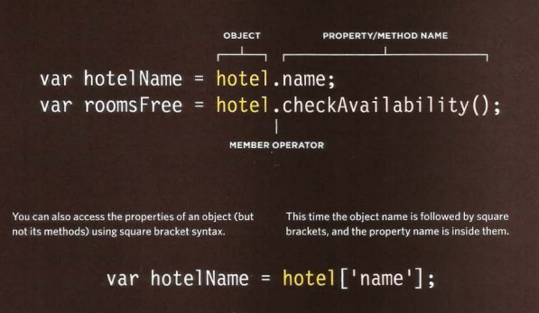

# Domain Modeling
---
it is creating model for a problem, that verfy and validate it.
Effective domain modeling may only occur in the context of the system-level requirements, often captured as use-cases or other means. In this case, nouns, captured from the requirements, become valid candidates for domain entities while verbs may represent behaviors and relationships.
# Tables:
Table represents data in grids.Grids allow us to understand
complex data by referencing
information on two axes.
* `<table>` the table element
* `<th>` the table header
* `<td></td>` the content
* `<tr>` table row
* `</tr>`
* `</table>`

---
The colspan attribute can be
used on a `<th>` or `<td>` element
and indicates how many columns
that cell should run across.
 

---
The rowspan attribute can be
used on a `<th>` or `<td>` element
to indicate how many rows a cell
should span down the table.

---
## For long Tables we use `<thead>` and put all table header elements inside it , `<tbody>` and `<tfooter>` as well.
### **Width, spacing, borders and background are used in tables**

# JS Functions, methods and objects.
## **Functions:**
### *The function is the way to store the steps needed to achive a task, it is used to reduce the code.*

### ***Function should be given a name describes the task, calling the function is asking it to perform its task.***

#### *The finction has a **Name** , **UpdateMessage** , and the **Value**. When you call the function's name it will run the statements assigned inside the **Value** .*

    Functionkeyword FunctionName () {
        Statement to be excuted ();
    }

### When the function needs information to rum the statement we put the information iside the ( ) as variables.
****
### Example:

    function printInput (orderf,numOfbedsf){
    document.write ('Your choice is :'+ orderf +' room Consists of '+numOfbedsf+ 'beds');
    }
    printInput (order,numOfbeds)

## OBJECT
Objects group together a set of variables and functions to create a model
of a something you would recognize from the real world.
### IN AN OBJECT: VARIABLES BECOME KNOWN AS PROPERTIES
### IN AN OBJECT: FUNCTIONS BECOME KNOWN AS METHODS

`var myCar = new Object();
myCar.make = 'Ford';
myCar.model = 'Mustang';
myCar.year = 1969;`

`// four variables are created and assigned in a single go,
// separated by commas
var myObj = new Object(),
    str = 'myString',
    rand = Math.random(),
    obj = new Object();
myObj.type              = 'Dot syntax';
myObj['date created']   = 'String with space';
myObj[str]              = 'String value';
myObj[rand]             = 'Random Number';
myObj[obj]              = 'Object';
myObj['']               = 'Even an empty string';
console.log(myObj);`

